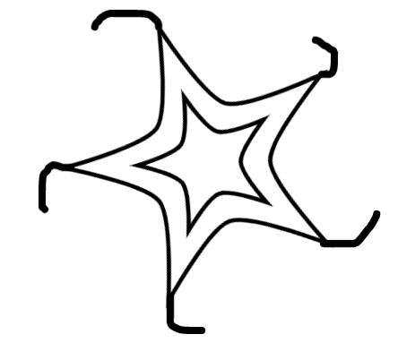

# Modern Algebra HW 6
## Luke LaValva

### Chapter 25

4) Show that $\langle a, b\ |\ a^5=b^2=e, ba=a^2b\rangle$ is isomorphic to $\mathbb{Z}_2$.
    $$
      \begin{align*}
        ba  & = a^2b                  \\
        bba & = ba^2b                 \\
        a   & = baab                  \\
        a   & = b(baab)(baab)b        \\
        a   & = (b^2)a^2(b^2)a^2(b^2) \\
        a   & = a^4                   \\
        a^2 & = a^5 = e               \\
        a   & = e
      \end{align*}
    $$
    Since $a=e$, $\langle a, b\ |\ a^5=b^2=e, ba=a^2b\rangle=\langle a,b\ |\ a=b^2=e\rangle$. If we set $a=0$ and $b=1$, this describes $\mathbb{Z}_2$.

$%$

7) In any group, show that $\langle a, b\rangle=\langle a, ab\rangle$.

    Let $G=\langle a, b\rangle$. Then $ab\in G$, so $\langle a, ab\rangle\subseteq G$.

    Let $G=\langle a, ab\rangle$. Then $a^{-1}\in G\implies (a^{-1}(ab)=b)\in G$, $\langle a, b\rangle\subseteq G$.

$%$

8) Let $\alpha = (12)(34)$ and $\beta = (24)$. Show that the group generated by $\alpha$ and $\beta$ is isomorphic to $D_4$.
    $$
      \begin{align*}
        \alpha^2 = (12)(34)(12)(34) & = e \\
        \beta^2 = (24)(24) & = e          \\
        \alpha\beta = (12)(34)(24) & = (1234) \\
        (\alpha\beta)\beta = (1234)(24) & = (12)(34) = \alpha \\
      \end{align*}
    $$
    Let $\delta=\alpha\beta$. Then we can defined $G$ such that
    $$
      G=\langle \delta, \beta\ |\ \delta^4=\beta^2=(\delta\beta)^2=e \rangle
    $$
    We know from exercise 7 that $\langle \beta, \alpha\beta\rangle=\langle \beta, \alpha\rangle$, so $G=\langle (12)(34), (24)\rangle$. Also, the generator above characterizes a dihedral group.

$%$

10) What is the minimum number of generators needed for $\mathbb{Z}_2 \oplus \mathbb{Z}_2 \oplus \mathbb{Z}_2$? Find a set of generators and relations for this group.

    This group requires 3 generators. We can define $G$ such that
    $$
      G=\langle a, b, c\ |\ a^2=b^2=c^2=e, ab=ba, ac=ca, bc=cb \rangle.
    $$

$%$

11) Suppose that $x^2=y^2=e$ and $yz=zxy$. Show that $xy=yx$.
    $$
    \begin{align*}
      yz  & = zxy \\
      yyz & = yzxy \\
      z   & = y(yzxy)xy \\
      z   & = zxyxy \\
      e   & = xyxy \\
      x   & = yxy \\
      xy  & = yx
    \end{align*}
    $$

$%$

12) Let $G = \langle a, b\ |\ a^2=b^4=e, ab=b^3a\rangle$.
    1) Express $a^3b^2abab^3$ in the form $b^ia^j$.
        $$
          \begin{align*}
            a^3b^2abab^3
              & = (ab)babab^3 \\
              & = (b^3a)babab^3 \\
              & = b^3(b^3a)abab^3 \\
              & = b^2(aa)b(ab)b^2 \\
              & = b^3(b^3a)b^2 \\
              & = b^2(b^3a)b \\
              & = b(b^3)a \\
              & = a
          \end{align*}
        $$
    2) Express $b^3abab^3a$ in the form $b^ia^j$.
        $$
          \begin{align*}
            b^3abab^3a
              & = b^3(b^3a)ab^3 \\
              & = b^9 \\
              & = b^4
          \end{align*}
        $$

$%$

13) Let $G=\langle a, b\ |\ a^2=b^2=(ab)^2\rangle$.
    1) Express $b^2abab^3$ in the form $b^ia^j$.
        $$
          \begin{align*}
            b^2abab^3
              & = b^2(abab)b^2 \\
              & = b^2b^2b^2 \\
              & = b^6
          \end{align*}
        $$
    2) Express $b^3abab^3a$ in the form $b^ia^j$.
        $$
          \begin{align*}
            b^3abab^3a
              & = b^3(abab)b^2a \\
              & = b^3b^2b^2a \\
              & = b^7a
          \end{align*}
        $$

$%$

17) Let $G=\langle x, y\ |\ x^8=y^2=yxyx^3=e\rangle$ Show that $|G|\leq 16$. Assuming that $|G|=16$, find the center of $G$ and the order of $xy$.
    $$
      \begin{align*}
        e & = yxyx^3 \\
        y & = xyx^3 \\
        yx^5 & = xy \\
        xy & = yx^5        
      \end{align*}
    $$
    Because of this relationship, we know that any $g\in G$ may be represented as $y^ix^j$, where $i\in\mathbb{Z}_2$ and $j\in\mathbb{Z}_8$. Thus, the maximum possible order of $G$ is $8\cdot 2=16$.

    If $G$ were Abelian, then $yxyx^3=x^4=e$ and the maximum order would be 8, so we know that $G$ is not Abelian.

    It can be quickly derived that $y=y^{-1}$, so if there exists some $x^i$ such that $yx^iy=x^i$ then $x^i\in Z(G)$. Using the relationships in the generator, we find that
    $$
      \begin{align*}
        e & = yxyx^3 \\
        x^5 & = yxy \\
        x & = yx^5y \\
        x^2 & = (yx^5y)(yx^5y) \\
        x^2 & = yx^2y,
      \end{align*}
    $$
    so it is clear that $x^2\in Z(G)$ and $\langle x^2\rangle\subseteq Z(G)$. We also know that $y\neq xyx^-1$ and $x\neq yxy$, so $\langle x^2\rangle = Z(G)$.

$%$

20) Let $G=\langle s, t\ |\ sts = tst\rangle$. Show that the permutations $(23)$ and $(13)$ satisfy the defining relations of $G$. Explain why this proves that $G$ is non-Abelian.
    $$
      \begin{align*}
        (23)(13)(23) & = (12) \\
        (13)(23)(13) & = (12) \\
        (23)(13)(23) & = (13)(23)(13)
      \end{align*}
    $$
    These elements both have an order of 2, so if $G$ is Abelian then $sts=sst=t$ and $tst=tts=s$, so $s=t$. However, $(23)\neq(13)$. Thus, $G$ is not Abelian.

$%$

21) In $D_{12}=\langle x, y\ |\ x^2=y^{12}=e, xyx=y^{-1}\rangle$, prove that the subgroup $H=\langle x, y^3\rangle$ (which is isomorphic to $D_4$) is not a normal subgroup.

    In order for H to be normal in G, it must contain $yxy^{-1}$. Therefore, if $yxy^{-1}\notin H$ then $H\ntriangleleft G$. We know that
    $$
      \begin{align*}
        yxy^{-1}
          & = yx(xyx) \\
          & = y^2x \\
          & \notin \{e, y^3, y^6, y^9, x, xy^3, xy^6, xy^9\},
      \end{align*}
    $$
    so $H$ cannot be normal in $G$.

$%$

23) Let $G=\langle a, b\ |\ a^6=b^3=e, b^{-1}ab=a^3 \rangle$. How many elements does $G$ have? To what familiar group is $G$ isomorphic?
    $$
    \begin{align*}
      b^2ab & = a^3 \\
      ab    & = ba^3
    \end{align*}
    $$
    This tells us that any $g\in G$ can be expressed as $b^ia^j$, where $i\in \mathbb{Z}_3$ and $j\in \mathbb{Z}_6$. However, we also know that
    $$
    \begin{align*}
      a
        & = ba^3b^2 \\
        & = b(ba^3b^2)(ba^3b^2)(ba^3b^2)b^2 \\
        & = b^2a^3b \\
        & = b^2(ba^3b^2)(ba^3b^2)(ba^3b^2)b \\
        & = a^3 \\
      e & = a^2,
    \end{align*}
    $$
    so we can actually reduce the space for $j$ to $\mathbb{Z}_2$. Thus, there are at most $2\times 3=6$ elements in $G$. We also now know that $b^3ab=a\implies ab=ba$, so $G$ must be Abelian. There is only one Abeilan isomorphism class of order 6, so $G\cong \mathbb{Z}_6$.

$%$

27) Let $G=\langle a,b,c,d\ |\ ab=c, bc=d, cd=a, da=b\rangle$. Determine $|G|$.
    $$
      \begin{matrix}
        \begin{align*}
          a & = a
        \end{align*}
        &
        \begin{align*}
          b & = da \\
          b & = (bc)a \\
          e & = ca \\
          c & = a^{-1}
        \end{align*}
        &
        \begin{align*}
          c & = ab \\
          c & = ada \\
          a^{-1} & = ada \\
          d & = a^{-3}
        \end{align*}
        &
        \begin{align*}
          d & = bc \\
          a^{-3} & = ba^{-1} \\
          b & = a^{-2}
        \end{align*}
      \end{matrix}
    $$
    Thus,
    $$
      \begin{align*}
        a & = bc \\
        a & = a^{-2}a^{-1} \\
        a^4 & = e
      \end{align*}
    $$
    Therefore, $G\cong \mathbb{Z}_4$.

$%$

28) Let $G=\langle a, b\ |\ a^2=b^2=e, aba=bab\rangle$. To what familiar group is $G$ isomorphic?
    
    Theorem $25.5$ tells us that any group generated by a pair of elements of order 2 is a dihedral group $D_n$ where $|ab|=n$. Then
    $$
      (ab)^2 = abab = babb = ba
    $$
    and
    $$
      (ab)^3 = baab = e,
    $$
    so $G\cong D_3$.

$%$

29) Let $G=\langle a, b\ |\ a^3=b^2=aba^{-1}b^{-1}=e \rangle$. To what familiar group is $G$ isomorphic?
    $$
      aba^{-1}b^{-1}=e\implies ab=ba
    $$
    $G$ is clearly an Abelian group of order 6, and since there is only one isomorphism class that is Abelian and has an order of 6 $G\cong \mathbb{Z}_6$.

### Chapter 26

1) Show that an isometry of $\mathbb{R}^n$ is one-to-one.

    The distance between any two points in $\mathbb{R}^n$ is always the same, by definition of isometry.

$%$

3) Exhibit a plane figure whose plane symmetry group is $\mathbb{Z}_5$.

    

$%$

5) What is the order of the (entire) symmetry group of $\mathbb{R}^3$ of a 3-prism?

    We have 3 rotations about the line that goes through both ends of the triangles, and 2 rotations about each of the 3 lines that go through the center of a rectangle. This is a total of 6 positions, including $e$. We can also reflect the 3-prism by the plane in between the two triangles, and combine this reflection with each rotation for a total of 12 positions.

$%$

6) What is the order of the symmetry group of $\mathbb{R}^3$ of a 4-prism (a box with square ends that is not a cube)?

    There are 4 rotations about the line that goes through the centers of the squares, and 2 rotations about each of the 4 lines that go through the center of a rectangle. This is a total of 8 positions, including $e$. We can also reflect the 4-prism by the plane in between the two squares, and combine this reflection with each rotation for a total of 16 positions.

$%$

10) The letters of the alphabet can be sorted into the following categories:
    1) FGJLNPQRSZ
    2) BCDEK
    3) AMTUVWY
    4) HIOX

    What defines the categories?
    1) Not symmetrical
    2) Vertically Symmetrical
    3) Horizontally Symmetrical
    4) Both Vertically and Horizontally Symmetrical

$%$

12) Why is inversion not listed as one of the four kinds of isometries in $\mathbb{R}^2$?

    Inversion is the same as a rotation by $180^{\circ}$ in $\mathbb{R}^2$.

$%$

13) Explain why inversion through a point in $\mathbb{R}^3$ cannot be realized by a rotation in $\mathbb{R}^3$.

    A rotation fixes an entire line, and an inversion fixes only a single point.

$%$

15) In $\mathbb{R}^2$, a rotation fixes a point; In $\mathbb{R}^3$, a rotation fixes a line; In $\mathbb{R}^4$, what does a rotation fix? Generalize to $\mathbb{R}^n$.

    In $\mathbb{R}^4$, a rotation fixes a subspace of dimension 3. In general, a rotation in $\mathbb{R}^n$ fixes a subspace of dimension $n-1$.

$%$

19) Suppose that an isometry of a plane fixes exactly one point. What type of isometry must it be?

    This isometry may be a rotation.

$%$

20) Suppose that $A$ and $B$ are rotations of $180^{\circ}$ about the points $a$ and $b$, respectively. What is $A$ followed by $B$? How is the composite motion related to the points $a$ and $b$?

    This is equivalent to performing the translation that would bring $A$ to $B$ twice.